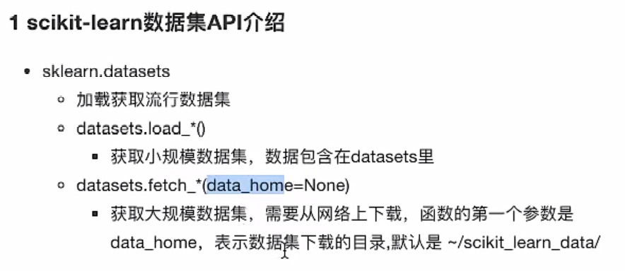

人工智能阶段
    机器学习 三天
    深度学习 三天
    量化交易 四天

传统的机器学习算法
    机器学习概述、特征工程 1天
    分类算法             1天
    回归算法、聚类        1天

## 机器学习概述

###  1.1 人工智能概述

​        达特茅斯会议-人工智能的起点
​        机器学习是人工智能的一个实现途径
​        深度学习是机器学习的一个方法发展而来
​        1.1.2 机器学习、深度学习能做些什么
​            传统预测
​            图像识别
​            自然语言处理

### 1.2 什么是机器学习

​        数据
​        模型
​        预测
​        从历史数据当中获得规律？这些历史数据是怎么的格式？
​        1.2.3 数据集构成
​            特征值 + 目标值

###  1.3 机器学习算法分类

​        监督学习
​            目标值：类别 - 分类问题
​                k-近邻算法、贝叶斯分类、决策树与随机森林、逻辑回归
​            目标值：连续型的数据 - 回归问题
​                线性回归、岭回归
​        目标值：无 - 无监督学习
​            聚类 k-means
​        1、预测明天的气温是多少度？ 回归
​        2、预测明天是阴、晴还是雨？ 分类
​        3、人脸年龄预测？ 回归/分类
​        4、人脸识别？ 分类
​    1.4 机器学习开发流程
​        1）获取数据
​        2）数据处理
​        3）特征工程
​        4）机器学习算法训练 - 模型
​        5）模型评估
​        6）应用
​    1.5 学习框架和资料介绍
​        1）算法是核心，数据与计算是基础
​        2）找准定位
​        3）怎么做？
​            1、入门
​            2、实战类书籍
​            3、机器学习 -”西瓜书”- 周志华
​               统计学习方法 - 李航
​               深度学习 - “花书”
​        4）1.5.1 机器学习库与框架

## 特征工程

### 2.1 数据集

​        2.1.1 可用数据集
​            公司内部 百度
​            数据接口 花钱
​            数据集

​            学习阶段可以用的数据集：
​                1）sklearn
​                2）kaggle
​                3）UCI
​            1 Scikit-learn工具介绍
​        2.1.2 sklearn数据集

​            sklearn.datasets
​                load_*  获取小规模数据集
​                fetch_* 获取大规模数据集
​                2 sklearn小数据集
​                    sklearn.datasets.load_iris()
​                3 sklearn大数据集
​       sklearn.datasets.fetch_20newsgroups(data_home=None,subset=‘train’)
​                4 数据集的返回值
​                    datasets.base.Bunch（继承自字典）
​                        dict["key"] = values
​                        bunch.key = values
​                思考：拿到的数据是否全部都用来训练一个模型？
​        2.1.3 数据集的划分
​            训练数据：用于训练，构建模型
​            测试数据：在模型检验时使用，用于评估模型是否有效
​                测试集 20%~30%
​                sklearn.model_selection.train_test_split(arrays, *options)
​                训练集特征值，测试集特征值，训练集目标值，测试集目标值
​                x_train, x_test, y_train, y_test

###  2.2 特征工程介绍

​        算法 特征工程
​        2.2.1 为什么需要特征工程(Feature Engineering)

​        2.2.2 什么是特征工程
​            sklearn 特征工程
​            pandas 数据清洗、数据处理

###  2.3  特征抽取/特征提取

​                    机器学习算法 - 统计方法 - 数学公式
​                        文本类型 -》 数值
​                        类型 -》 数值
​                    2.3.1 特征提取
​                        sklearn.feature_extraction
​                    2.3.2 字典特征提取 - 类别 -> one-hot编码

​                        sklearn.feature_extraction.DictVectorizer(sparse=True,…)
​                        vector 数学：向量 物理：矢量
​                            矩阵 matrix 二维数组
​                            向量 vector 一维数组
​                        父类：转换器类
​                        返回sparse矩阵
​                            sparse稀疏
​                                将非零值 按位置表示出来
​                                节省内存 - 提高加载效率
​                        应用场景：
​                            1）pclass, sex 数据集当中类别特征比较多
​                                1、将数据集的特征-》字典类型
​                                2、DictVectorizer转换
​                            2）本身拿到的数据就是字典类型
​                     2.3.3 文本特征提取

​                        单词 作为 特征
​                        句子、短语、单词、字母
​                        特征：特征词
​                        方法1：CountVectorizer
​                            统计每个样本特征词出现的个数
​                            stop_words停用的
​                            停用词表
​                        关键词：在某一个类别的文章中，出现的次数很多，但是在其他类别的文章当中出现很少

​                        方法2：TfidfVectorizer
​                            TF-IDF - 重要程度
​                            两个词 “经济”，“非常”
​                            1000篇文章-语料库
​                            100篇文章 - "非常"
​                            10篇文章 - “经济”
​                            两篇文章
​                            文章A(100词) : 10次“经济” TF-IDF:0.2
​                                tf:10/100 = 0.1
​                                idf:lg 1000/10 = 2
​                            文章B(100词) : 10次“非常” TF-IDF:0.1
​                                tf:10/100 = 0.1
​                                idf: log 10 1000/100 = 1
​                                对数？
​                                    2 ^ 3 = 8
​                                    log 2 8 = 3
​                                    log 10 10 = 1
​                            TF - 词频（term frequency，tf)
​                            IDF - 逆向文档频率

### 2.4 特征预处理

​     2.4.1 什么是特征预处理

​                  通过一些转换函数将特征数据转换成更加适合算法模型的特征数据。

​              包含内容：归一化、标准化

​              特征预处理API

​                 sklearn.preprocessing

​           为什么我们要进行归一化/标准化？

​               特征的单位或者大小相差较大，或者某特征的方差相比其他的特征要大出几个数量级，容易影响（支配）目标效果，使得一些算法无法学习到其他的特征。

​              需要使用到一些方法进行无量纲化，使不同规格的数据转换到同一规则
​        2.4.2 归一化

​                    异常值：最大值、最小值

​              注意最大最小值是变化的，另外最大值与最小值非常容易受到异常点影响，所以这红方法鲁棒性较差，只适合传统精确小数据场景。

                            

​                        2.4.3 标准化

​                          (x - mean) / std
​                            标准差：集中程度
​                            应用场景：
​                    在已有样本足够多的情况下比较稳定，适合现代嘈杂大数据场景。

###  2.5 特征降维

​                    2.5.1 降维 - 降低维度
​                        ndarray
​                            维数：嵌套的层数
​                            0维 标量
​                            1维 向量
​                            2维 矩阵
​                            3维
​                            n维
​                        二维数组
​                            此处的降维：
​                            降低特征的个数
​                            效果：
​                            特征与特征之间不相关
​                    2.5.1 降维

​                        特征选择
​                            Filter过滤式
​                                方差选择法：低方差特征过滤
​                                相关系数 - 特征与特征之间的相关程度

​                                    取值范围：–1≤ r ≤+1
​                                    皮尔逊相关系数（卡方检验）
​                                    0.9942
​                                    特征与特征之间相关性很高：
​                                        1）选取其中一个
​                                        2）加权求和
​                                        3）主成分分析
​                            Embeded嵌入式
​                                决策树 第二天
​                                正则化 第三天
​                                深度学习 第五天

###  主成分分析

 2.6.1 什么是主成分分析(PCA)
                                sklearn.decomposition.PCA(n_components=None)
                                n_components
                                    小数 表示保留百分之多少的信息
                                    整数 减少到多少特征

 2.6.2 案例：探究用户对物品类别的喜好细分

数据文件 instacart 过大 未放在github

                                用户          物品类别
                                user_id         aisle
                                1）需要将user_id和aisle放在同一个表中 - 合并
                                2）找到user_id和aisle - 交叉表和透视表
                                3)特征冗余过多 -> PCA降维