分类算法

目标值：类别

1、sklearn转换器和预估器
2、KNN算法
3、模型选择与调优
4、朴素贝叶斯算法
5、决策树
6、随机森林

3.1 sklearn转换器和估计器
    转换器
    估计器(estimator)
    3.1.1 转换器 - 特征工程的父类
        1 实例化 (实例化的是一个转换器类(Transformer))
        2 调用fit_transform(对于文档建立分类词频矩阵，不能同时调用)
        标准化：
            (x - mean) / std
            fit_transform()
                fit()           计算 每一列的平均值、标准差
                transform()     (x - mean) / std进行最终的转换
    3.1.2 估计器(sklearn机器学习算法的实现)

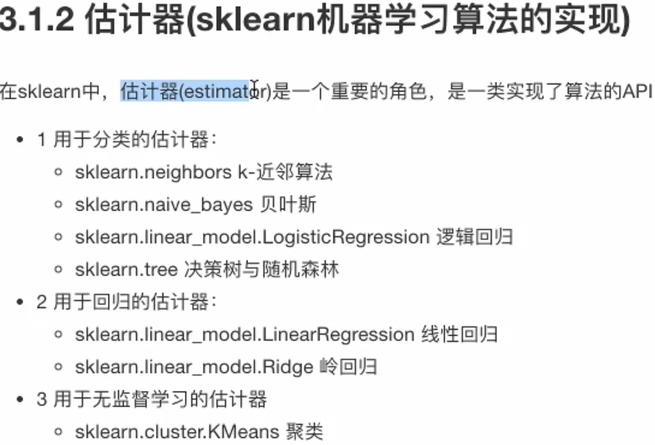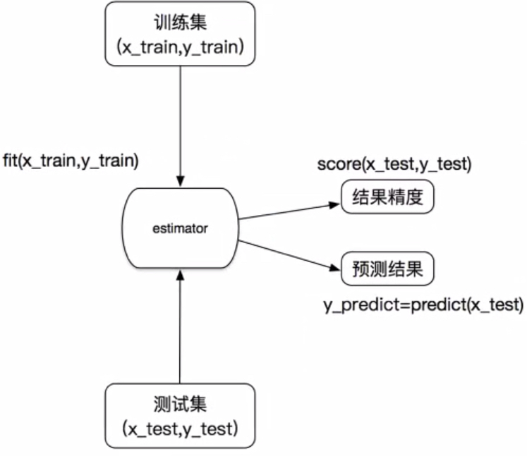

​        估计器(estimator)
​            1 实例化一个estimator
​            2 estimator.fit(x_train, y_train) 计算
​                —— 调用完毕，模型生成
​            3 模型评估：
​                1）直接比对真实值和预测值
​                    y_predict = estimator.predict(x_test)
​                    y_test == y_predict
​                2）计算准确率
​                    accuracy = estimator.score(x_test, y_test)
3.2 K-近邻算法
​    3.2.1 什么是K-近邻算法

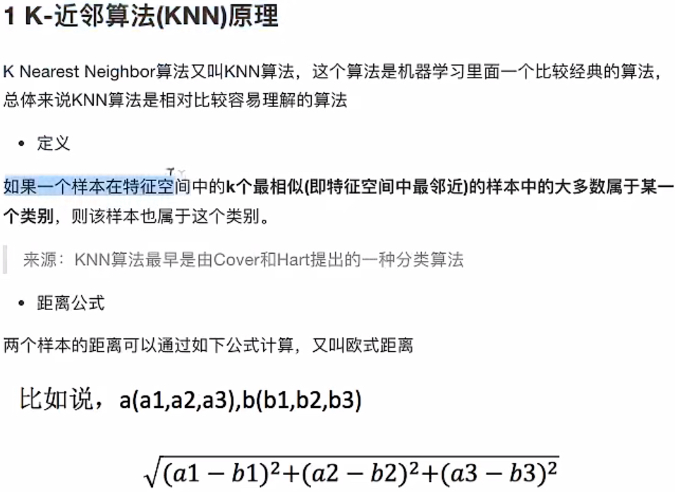

​        KNN核心思想：
​            你的“邻居”来推断出你的类别
​        1 K-近邻算法(KNN)原理
​            k = 1
​                容易受到异常点的影响
​            如何确定谁是邻居？
​            计算距离：
​                距离公式
​                    欧氏距离
​                    曼哈顿距离 绝对值距离
​                    明可夫斯基距离
​        2 电影类型分析
​            k = 1 爱情片
​            k = 2 爱情片
​            ……
​            k = 6 无法确定
​            k = 7 动作片

如果取的最近的电影数量不一样？会是什么结果？
k 值取得过小，容易受到异常点的影响
                k 值取得过大，样本不均衡的影响
            结合前面的约会对象数据，分析K-近邻算法需要做什么样的处理
                无量纲化的处理
                标准化

            sklearn.neighbors.KNeighborsClassifier(n_neighbors=5,algorithm='auto')
            n_neighbors：k值
        3.2.3 案例1：鸢尾花种类预测
            1）获取数据
            2）数据集划分
            3）特征工程
                标准化
            4）KNN预估器流程
            5）模型评估
        3.2.4 K-近邻总结
            优点：简单，易于理解，易于实现，无需训练
            缺点：
                1）必须指定K值，K值选择不当则分类精度不能保证
                2）懒惰算法，对测试样本分类时的计算量大，内存开销大
            使用场景：小数据场景，几千～几万样本，具体场景具体业务去测试
    3.3 模型选择与调优
        3.3.1 什么是交叉验证(cross validation)

交叉验证：将拿到的训练数据，分为训练数据和验证数据

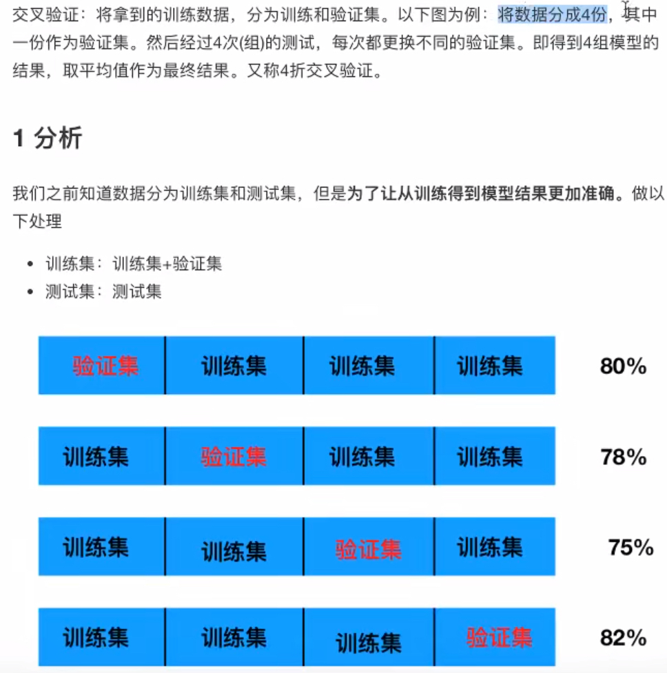

​        3.3.2 超参数搜索-网格搜索(Grid Search)

​        通常情况下有很多参数是需要手动指定的（如k-近邻算法的K值）这种叫超参数。但是手动过程复杂，所以需要对模型预设几种超参数组合，每组超参数都采用交叉验证来进行评估。最后选出最优参数组合建立模型

​            k的取值
​                [1, 3, 5, 7, 9, 11]
​                暴力破解

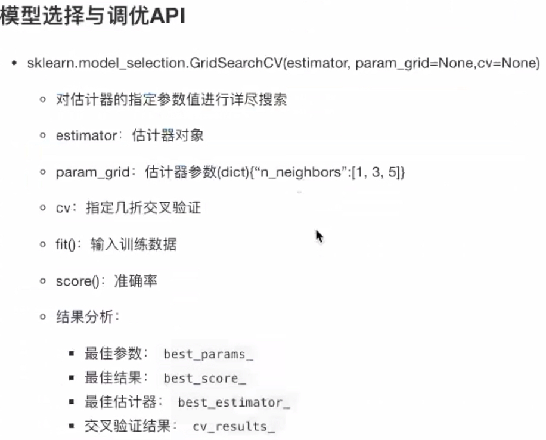

​        3.3.3 鸢尾花案例增加K值调优
​        3.2.4 案例：预测facebook签到位置

数据集太大 未上传github

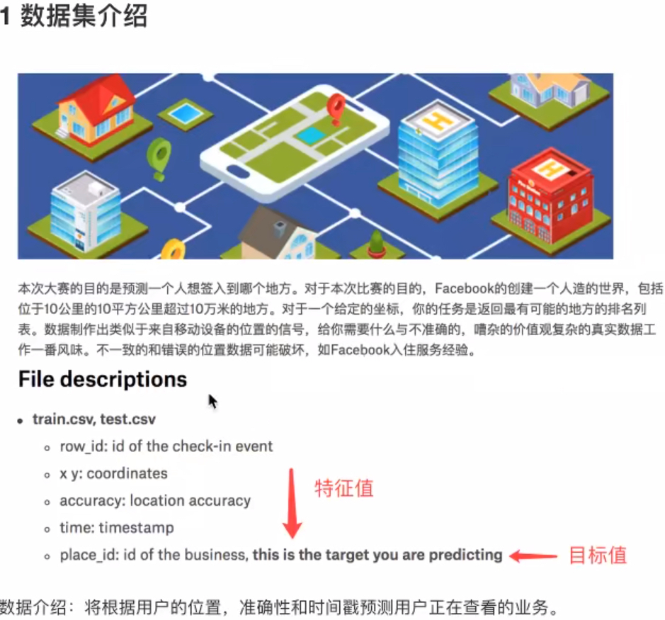

​            流程分析：
​                1）获取数据
​                2）数据处理
​                目的：
​                    特征值 x
​                    目标值 y
​                    a.缩小数据范围
​                      2 < x < 2.5
​                      1.0 < y < 1.5
​                    b.time -> 年月日时分秒
​                    c.过滤签到次数少的地点
​                    数据集划分
​                 3）特征工程：标准化
​                 4）KNN算法预估流程
​                 5）模型选择与调优
​                 6）模型评估
 3.4 朴素贝叶斯算法

​    3.4.1 什么是朴素贝叶斯分类方法
​    3.4.2 概率基础
​        1 概率(Probability)定义

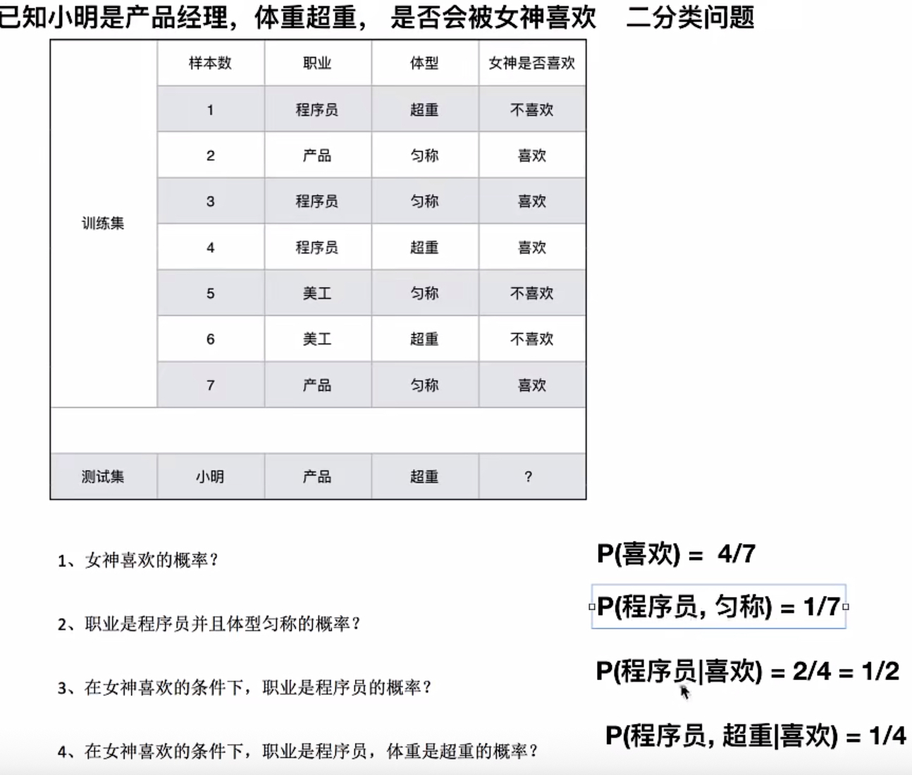

​        3.4.3 联合概率、条件概率与相互独立
​            联合概率：包含多个条件，且所有条件同时成立的概率
​            P(程序员, 匀称) P(程序员, 超重|喜欢)
​            P(A, B)
​            条件概率：就是事件A在另外一个事件B已经发生条件下的发生概率
​            P(程序员|喜欢) P(程序员, 超重|喜欢)
​            P(A|B)
​            相互独立:
​                P(A, B) = P(A)P(B) <=> 事件A与事件B相互独立
​        朴素？
​            假设：特征与特征之间是相互独立
​        朴素贝叶斯算法：

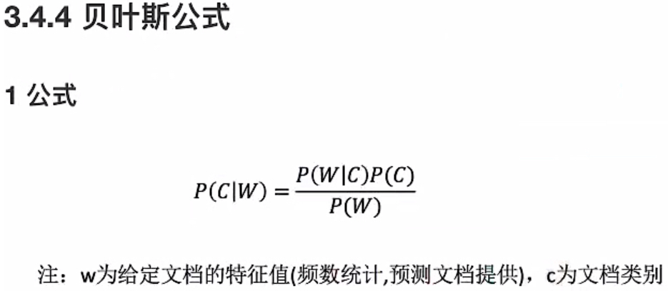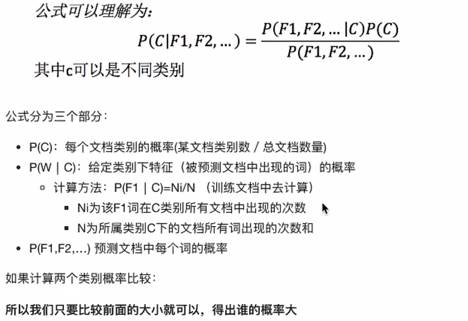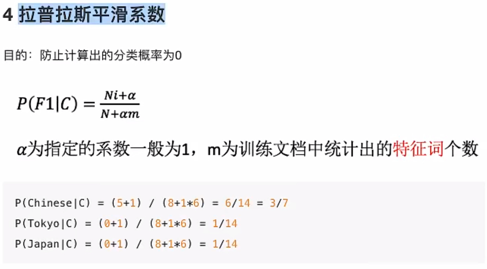

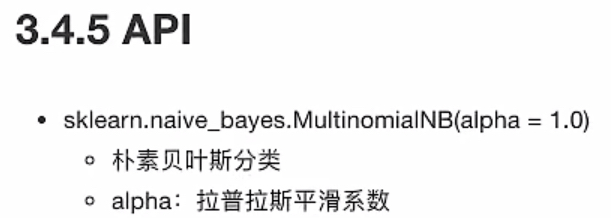

​            朴素 + 贝叶斯
​        应用场景：
​            文本分类
​            单词作为特征
​        拉普拉斯平滑系数
​    3.4.6 案例：20类新闻分类
​        1）获取数据
​        2）划分数据集
​        3）特征工程
​            文本特征抽取
​        4）朴素贝叶斯预估器流程
​        5)模型评估
​    3.4.7 朴素贝叶斯算法总结
​        优点：
​            对缺失数据不太敏感，算法也比较简单，常用于文本分类。
​            分类准确度高，速度快
​        缺点：
​            由于使用了样本属性独立性的假设，所以如果特征属性有关联时其效果不好

我爱北京天安门
3.5 决策树
    3.5.1 认识决策树
        如何高效的进行决策？
            特征的先后顺序
    3.5.2 决策树分类原理详解
        已知 四个特征值 预测 是否贷款给某个人
        先看房子，再工作 -> 是否贷款 只看了两个特征
        年龄，信贷情况，工作 看了三个特征
    信息论基础
        1）信息
            香农：消除随机不定性的东西
            小明 年龄 “我今年18岁” - 信息
            小华 ”小明明年19岁” - 不是信息
        2）信息的衡量 - 信息量 - 信息熵
            bit
            g(D,A) = H(D) - 条件熵H(D|A)
        4 决策树的划分依据之一------信息增益
        没有免费的午餐
    3.5.5 决策树可视化
    3.5.6 决策树总结
        优点：
            可视化 - 可解释能力强
        缺点：
            容易产生过拟合
    3.5.4 案例：泰坦尼克号乘客生存预测
        流程分析：
            特征值 目标值
            1）获取数据
            2）数据处理
                缺失值处理
                特征值 -> 字典类型
            3）准备好特征值 目标值
            4）划分数据集
            5）特征工程：字典特征抽取
            6）决策树预估器流程
            7）模型评估
3.6 集成学习方法之随机森林
    3.6.1 什么是集成学习方法
    3.6.2 什么是随机森林
        随机
        森林：包含多个决策树的分类器
    3.6.3 随机森林原理过程
        训练集：
        N个样本
        特征值 目标值
        M个特征
        随机
            两个随机
                训练集随机 - N个样本中随机有放回的抽样N个
                    bootstrap 随机有放回抽样
                    [1, 2, 3, 4, 5]
                    新的树的训练集
                    [2, 2, 3, 1, 5]
                特征随机 - 从M个特征中随机抽取m个特征
                    M >> m
                    降维
    3.6.6 总结
          能够有效地运行在大数据集上，
          处理具有高维特征的输入样本，而且不需要降维          