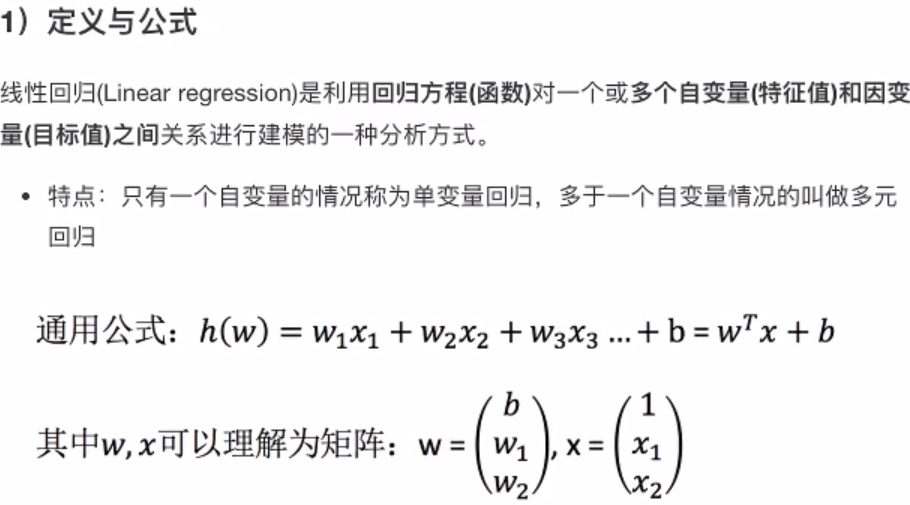
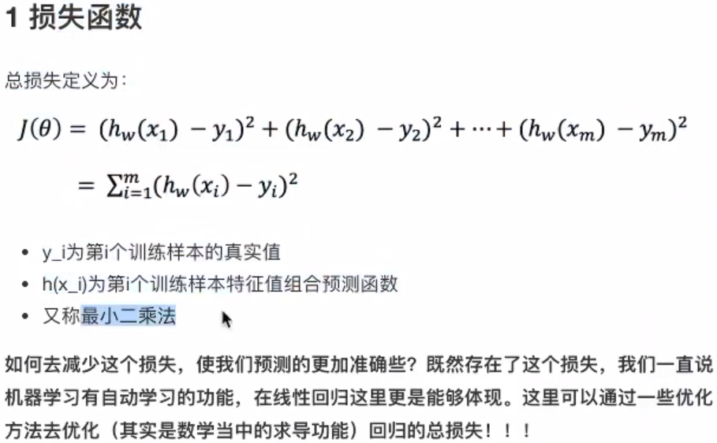
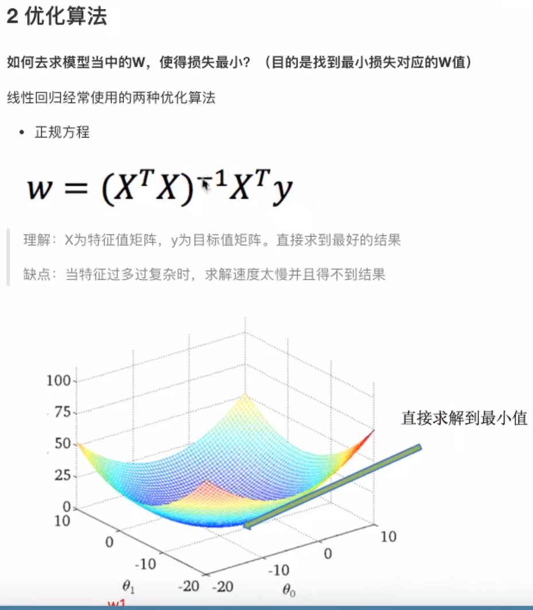
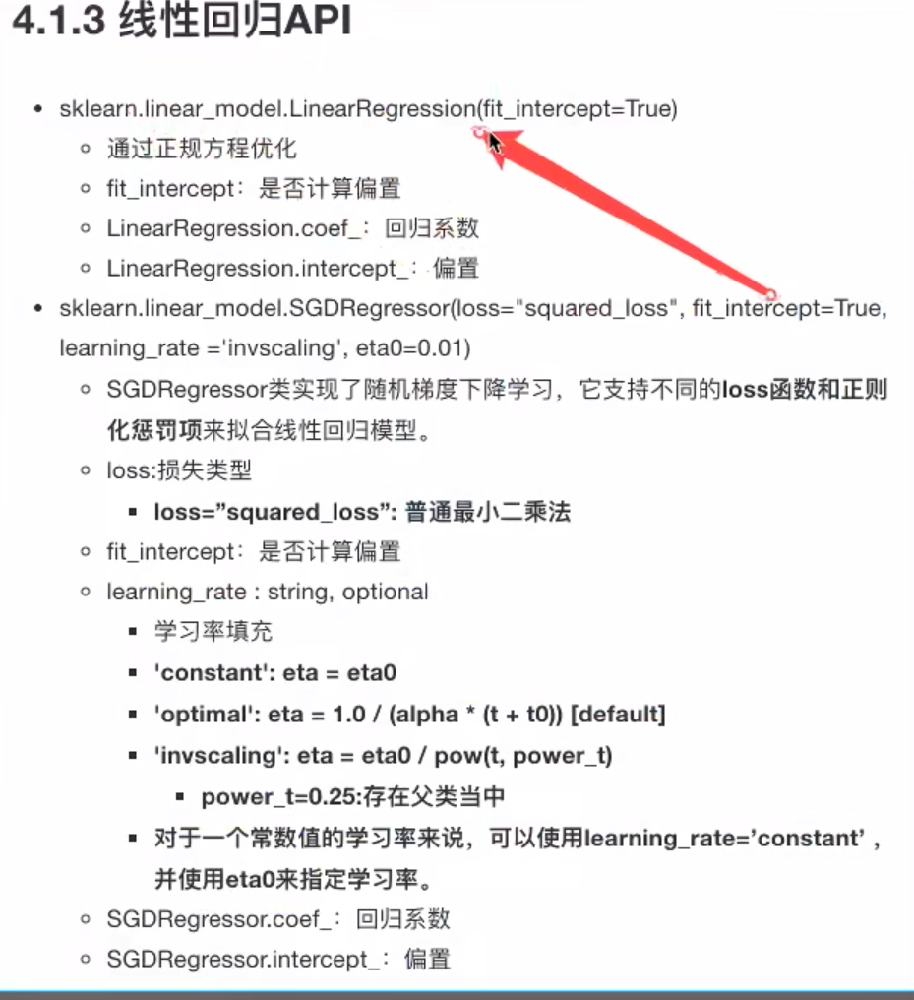
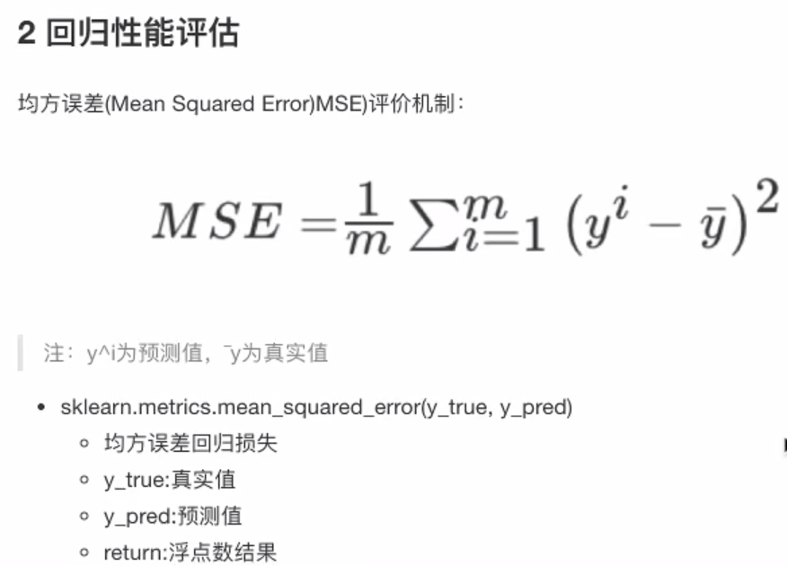
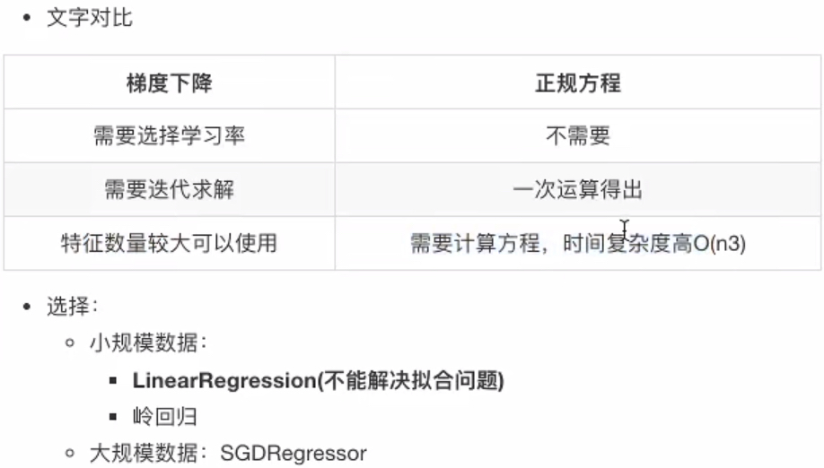
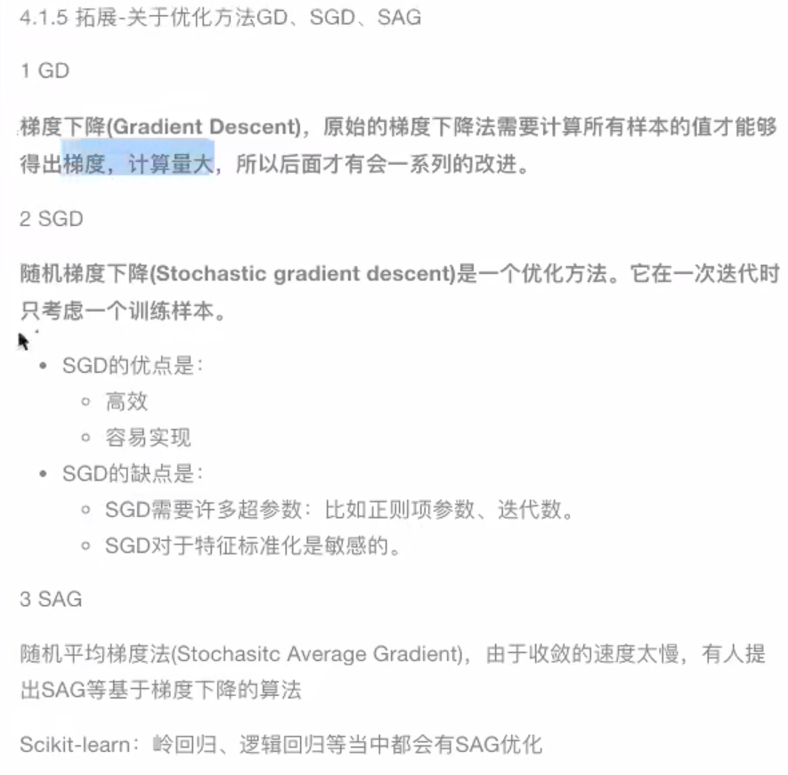
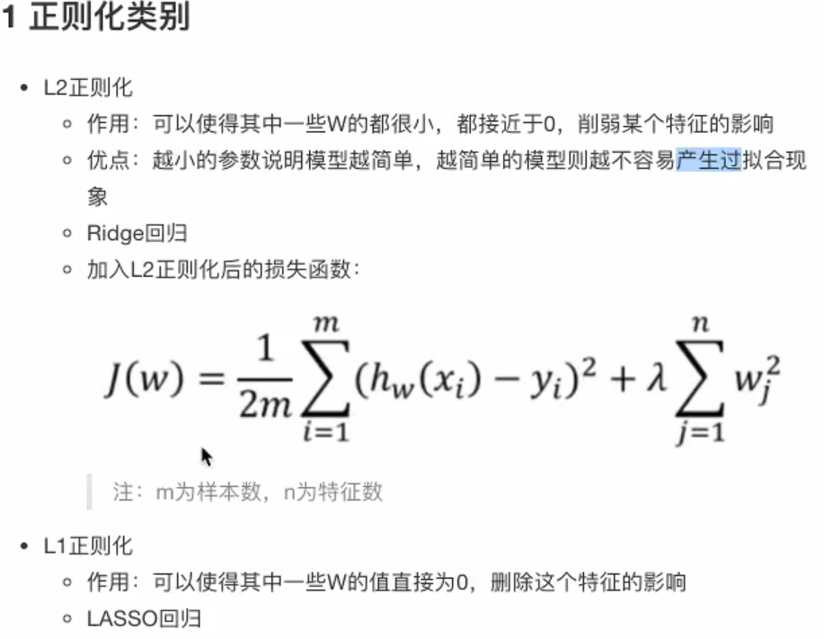
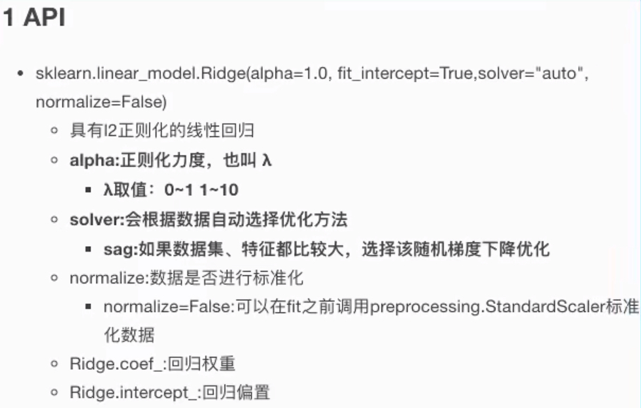

回归和聚类
线性回归
欠拟合与过拟合
岭回归

分类算法：逻辑回归
模型保存与加载

无监督学习 K-means算法
4.1 线性回归
    回归问题：
        目标值 - 连续型的数据
    4.1.1 线性回归的原理
        2 什么是线性回归
       
        函数关系 特征值和目标值
            线型模型
                线性关系
            y = w1x1 + w2x2 + w3x3 + …… + wnxn + b
              = wTx + b
            数据挖掘基础
            y = kx + b
            y = w1x1 + w2x2 + b
            y = 0.7x1 + 0.3x2
            期末成绩：0.7×考试成绩+0.3×平时成绩
            [[90, 85],
            []]
            [[0.3],
            [0.7]]
            [8, 2] * [2, 1] = [8, 1]
            广义线性模型
                非线性关系？
                线性模型
                    自变量一次
                     y = w1x1 + w2x2 + w3x3 + …… + wnxn + b
                    参数一次
                     y = w1x1 + w2x1^2 + w3x1^3 + w4x2^3 + …… + b
                线性关系&线性模型
                线性关系一定是线性模型
                线性模型不一定是线性关系
         4.1.2 线性回归的损失和优化原理（理解记忆）
            目标：求模型参数
                模型参数能够使得预测准确
         真实关系：真实房子价格 = 0.02×中心区域的距离 + 0.04×城市一氧化氮浓度 + (-0.12×自住房平均房价) + 0.254×城镇犯罪率
          随意假定：预测房子价格 = 0.25×中心区域的距离 + 0.14×城市一氧化氮浓度 + 0.42×自住房平均房价 + 0.34×城镇犯罪率
        损失函数/cost/成本函数/目标函数：
          最小二乘法
优化损失
​       优化方法？
正规方程

天才 - 直接求解W
​                    拓展：
​                    1)
​                        y = ax^2 + bx + c
​                        y' = 2ax + b = 0
​                        x = - b / 2a
​                    2)
​                        a * b = 1
​                            b = 1 / a = a ^ -1
​                        A * B = E
​                        [[1, 0, 0],
​                        [0, 1, 0],
​                        [0, 0, 1]]
​                        B = A ^ -1
梯度下降
勤奋努力的普通人 试错、改进

            4.1.4 波士顿房价预测
                流程：
                    1）获取数据集
                    2）划分数据集
                    3）特征工程：
                        无量纲化 - 标准化
                    4）预估器流程
                        fit() --> 模型
                        coef_ intercept_
                    5)模型评估
            回归的性能评估：
                均方误差
           

4 正规方程和梯度下降对比

4.2 欠拟合与过拟合
    训练集上表现得好，测试集上不好 - 过拟合
    4.2.1 什么是过拟合与欠拟合
        欠拟合
            学习到数据的特征过少
            解决：
                增加数据的特征数量
        过拟合
            原始特征过多，存在一些嘈杂特征， 模型过于复杂是因为模型尝试去兼顾各个测试数据点
            解决：
                    正则化
                    L1  损失函数 + λ惩罚项
                    别名 LASSO
                    L2 更常用 损失函数 + λ惩罚项
                    别名 Ridge - 岭回归
4.3 线性回归的改进-岭回归
    4.3.1 带有L2正则化的线性回归-岭回归

        alpha 正则化力度=惩罚项系数
4.4 分类算法-逻辑回归与二分类
    4.4.1 逻辑回归的应用场景
        广告点击率 是否会被点击
        是否为垃圾邮件
        是否患病
        是否为金融诈骗
        是否为虚假账号
        正例 / 反例
    4.4.2 逻辑回归的原理
        线型回归的输出 就是 逻辑回归 的 输入
        激活函数
            sigmoid函数 [0, 1]
            1/(1 + e^(-x))
        假设函数/线性模型
            1/(1 + e^(-(w1x1 + w2x2 + w3x3 + …… + wnxn + b)))
        损失函数
            (y_predict - y_true)平方和/总数
            逻辑回归的真实值/预测值 是否属于某个类别
            对数似然损失
            log 2 x
        优化损失
            梯度下降
    4.4.4 案例：癌症分类预测-良／恶性乳腺癌肿瘤预测
        恶性 - 正例
        流程分析：
            1）获取数据
                读取的时候加上names
            2）数据处理
                处理缺失值
            3）数据集划分
            4）特征工程：
                无量纲化处理-标准化
            5）逻辑回归预估器
            6）模型评估
    真的患癌症的，能够被检查出来的概率 - 召回率
    4.4.5 分类的评估方法
        1 精确率与召回率
            1 混淆矩阵
                TP = True Possitive
                FN = False Negative
            2 精确率(Precision)与召回率(Recall)
                精确率
                召回率 查得全不全
                工厂 质量检测 次品 召回率
            3 F1-score 模型的稳健型
       总共有100个人，如果99个样本癌症，1个样本非癌症 - 样本不均衡
       不管怎样我全都预测正例(默认癌症为正例) - 不负责任的模型
           准确率：99%
           召回率：99/99 = 100%
           精确率：99%
           F1-score: 2*99%/ 199% = 99.497%
           AUC:0.5
                TPR = 100%
                FPR = 1 / 1 = 100%
       2 ROC曲线与AUC指标
            1 知道TPR与FPR
                TPR = TP / (TP + FN) - 召回率
                    所有真实类别为1的样本中，预测类别为1的比例
                FPR = FP / (FP + TN)
                    所有真实类别为0的样本中，预测类别为1的比例
4.5 模型保存和加载
4.6 无监督学习-K-means算法
    4.6.1 什么是无监督学习
        没有目标值 - 无监督学习
    4.6.2 无监督学习包含算法
        聚类
        K-means(K均值聚类)
        降维
        PCA
    4.6.3 K-means原理
    4.6.5 案例：k-means对Instacart Market用户聚类
        k = 3
        流程分析：
        降维之后的数据
        1）预估器流程
        2）看结果
        3)模型评估
    4.6.6 Kmeans性能评估指标
        轮廓系数
        如果b_i>>a_i:趋近于1效果越好，
        b_i<<a_i:趋近于-1，效果不好。
        轮廓系数的值是介于 [-1,1] ，
        越趋近于1代表内聚度和分离度都相对较优。
    4.6.7 K-means总结
        应用场景：
            没有目标值
            分类